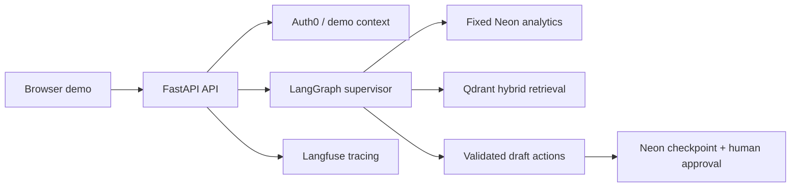

# Portfolio Evidence

## Architecture

The browser sends a governed question with tenant and role context. The supervisor
routes only to fixed SQL operations, cited retrieval, direct response, or draft-only
actions. Tenant predicates, role policy, schema validation, and approval gates run in
code; no arbitrary SQL or external action execution is exposed.

## Threat model

- **Tenant leakage:** prevent with authenticated tenant claims, SQL predicates, Qdrant
  payload filters, and returned-payload rechecks.
- **Privilege escalation:** prevent with centralized role/intent policy and server-owned
  risk and approver fields.
- **Prompt/tool injection:** treat model output as untrusted; bound arguments, reject
  embedded instructions, and keep tools fixed and read-only.
- **Credential exposure:** keep secrets in environment variables; redact identifiers from
  traces and return sanitized API errors with request IDs.
- **Unsafe actions:** drafts pause for human approval and remain `submission_allowed=false`.

## Demo script

1. Open the production URL and select **Founder / CFO**.
2. Ask: “Which high-velocity SKUs may stock out this week due to regional carrier delays?”
3. Show the structured answer, risk percentage, and governed route.
4. Ask the supplier-terms question and show document citations.
5. Switch to **Support Intern** and demonstrate a refusal for a restricted request.
6. Ask for a purchase-order draft; show `pending_approval`, then approve/reject it.
7. Submit an invalid short question and expand **Show technical details**.

## Measurements

- Golden evaluation: 50 locked cases; groundedness 96.9%; citation recall 90%.
- Security corpus: 21 adversarial cases; 100% pass rate.
- Forecasting: XGBoost MAE 2.92 vs lag-1 baseline 3.94.
- Data: 9,392 Neon rows and 49 authorized Qdrant chunks.
- Deployment: Vercel production health and stockout chat verified on commit `9d9d0a`.

## Limitations

- Demo identities are development-only; production hardening should use Auth0 browser login.
- Forecasting is a deterministic demonstration model, not a production planning system.
- Draft actions never call external systems; an integration would require a new approval
  and connector review.
- DagsHub and Cloudflare remain optional follow-up integrations.
